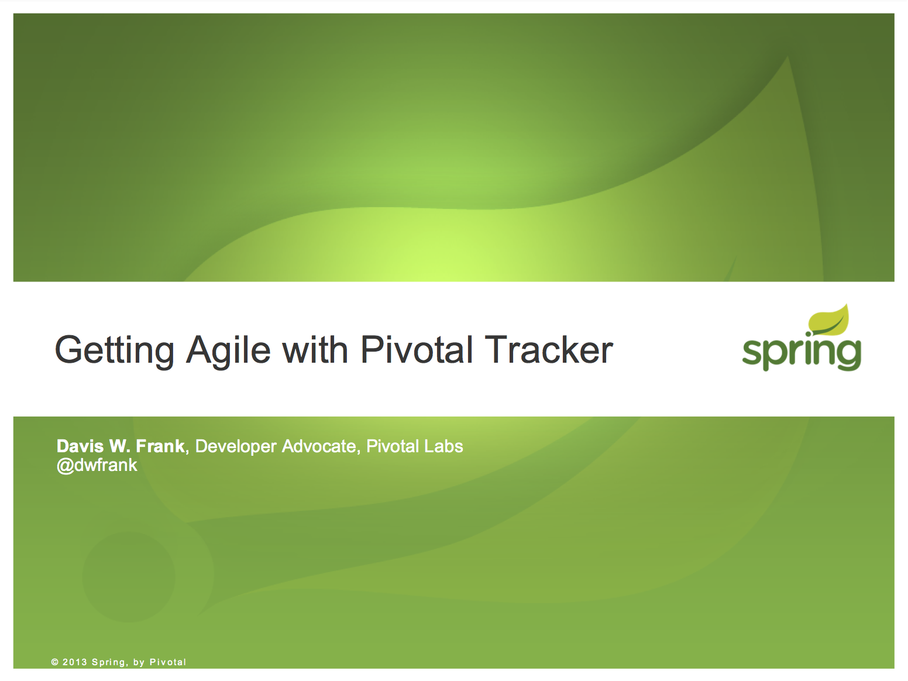

# 2013.09.05.TrackerWebinar

!SLIDE

!SLIDE

!NOTES

* We're a software consultancy
* We specialize in helping your team with...

!SLIDE

# Extreme

!SLIDE

# Lean

!SLIDE

# Agile

!NOTES

* The big buzzwords in software & startup development
* The terms are all loaded, with lots of baggage

!SLIDE bottom-right

}}} images/big_cup.jpg

# one big loop

!NOTES

* The key is taking a feedback loop, which tends to be like this

!SLIDE top-left

}}} images/little_cups.jpg

# lots of little loops

!NOTES

* And make it like this -
* Lots of small loops
* help you make small corrections along the right path for your business

!SLIDE

# JUST DO IT.

!NOTES

* Which means you execute....

!SLIDE top-left

}}} images/apollo.jpg

# Success

!SLIDE bottom-right

}}} images/rocket_fail.jpg

# Failure

!NOTES

* Or your didn't,
* in which case you can make a correction

!SLIDE discuss

## That works for __software__?

!NOTES

* Yes, with software
* All of the Agile/Lean/Extreme practices help this
* For example:

!SLIDE list

# TDD/CI
## prevent regression

!SLIDE list

# Pairing
## keep quality high

!SLIDE list

# Shared Ownership
## keep bus count high

!SLIDE list

# User Stories
## build for the *business*

!SLIDE list

# Short Iterations
## plan small, plan often

!SLIDE list

# Always Be Shipping
## improve product

!SLIDE list

# Retrospectives
## improve team &amp; process

!SLIDE

!NOTE

* How do you manage all of this?
* Day-to-day, milestone-to-milestone

!SLIDE

# Our Process
## From @ $7/month

!NOTES

* 20 years of how to manage an Agile software team
* packaged into a web app
* Written and maintained by a team that works this way
* You're soaking in it

!SLIDE discuss

Manages your prioritized list of work broken into fixed segments of time and predicts progress based on historical performance.

!NOTES

* What does Pivotal Tracker do?
* Everything you want any project management app to do

!SLIDE discuss

Manages your backlog of stories into iterations and predicts releases based on velocity.

!NOTES

* only with some different nouns

!SLIDE

# Simple tool
## Continuous communication

!SLIDE

## _Let's take a look_

!SLIDE

# Stories
## We have all 3 kinds

!NOTES

* Back to User Stories
* Your Backlog is made up of them - what are they?

!SLIDE list

# Feature
## Verifiable business value

!NOTES

* Business value first

!SLIDE list

# Feature
## "As a shopper I can add an item to my shopping cart so I can purchase it later."

!SLIDE list

# Chore
## Needed, but no verifiable business value for customer

!NOTES

* things your users won't notice, at least not directly
* examples:
  * add server monitoring
  * collapse Rails DB migrations
  * clean out logs

!SLIDE list

# Bug
## Work that fixes a defect to a previously accepted Feature

!NOTES

* NOT: it doesn't work as I expected - reject that story
* Something we agreed to that stopped working

!SLIDE

# Workflow
## Life of a story

!SLIDE list

# Backlog
## Position is priority

!NOTES

* DRAG AND DROP
* Devs should always be able to pull of the top story

!SLIDE list

# Velocity & Iterations
## "Yesterday's Weather"

!SLIDE list

# Velocity
## Volatility is the Enemy

!SLIDE list

# Release Markers
## date is optional &amp; helpful

!NOTES

* Blue if you're going to make it
* Turn red when velocity says you're going to miss it
* Time to drop stories or move dates

!SLIDE list

# Labels
## Tags FTW

!NOTES

* easier to search for groups of stories
* semantics: "Blocked", "needs discussion", "needs design"

!SLIDE list

# Epics
## Tracks, Themes
## Ship-all-at-once

!NOTES

* When a label needs more
* When multiple stories straddle release markers

!SLIDE

# Tracker.Next

!SLIDE

# Small Loops
# Big Progress

!NOTES

* This how we do it
* We want to teach you how

!SLIDE

!SLIDE

# Slides live here:

`https://github.com/infews/2013.09.05.GettingAgileWithPivotalTracker`

